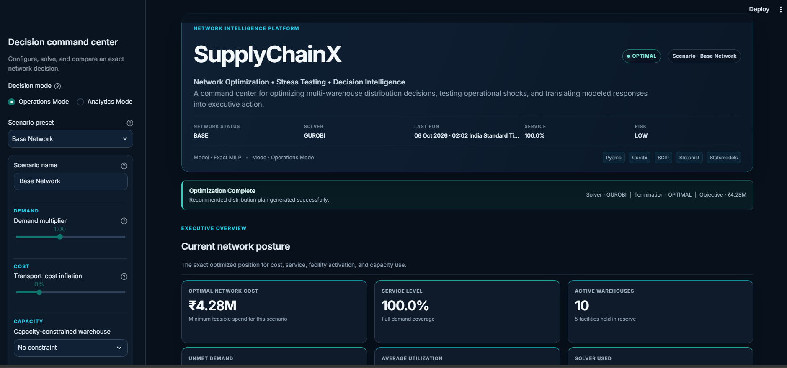
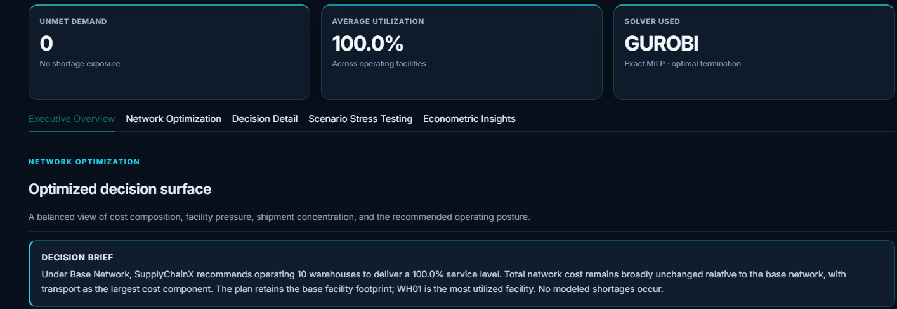
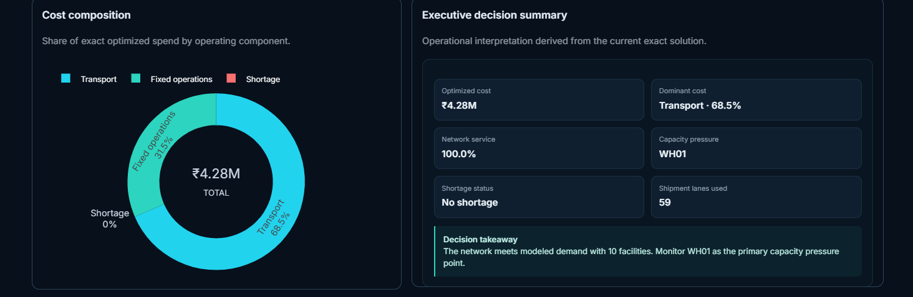
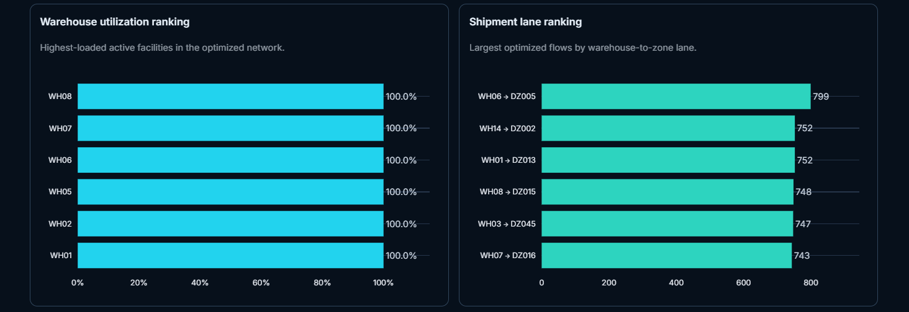
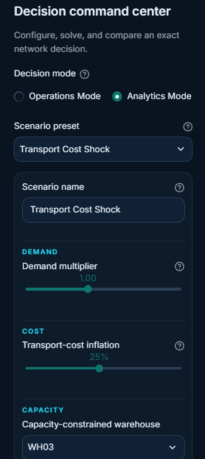
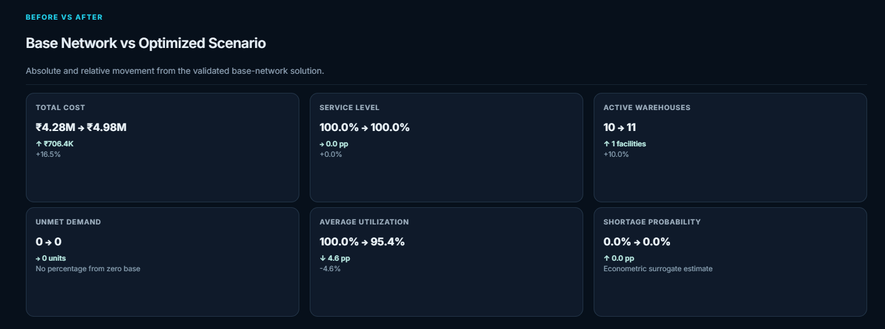
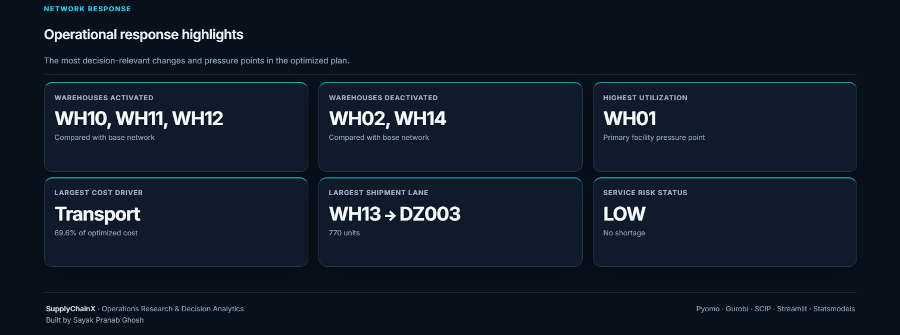

# SupplyChainX

**Multi-Warehouse Distribution & Network Optimization**

[](https://supplychainx-optimization.streamlit.app/)
[](https://github.com/sayakdoms/SupplyChainX)

> **Live application:** [Launch SupplyChainX](https://supplychainx-optimization.streamlit.app/)

SupplyChainX is a reproducible mixed-integer optimization project for deciding which warehouses to operate and how much to ship from each active warehouse to every demand zone. It is designed as an intermediate-level portfolio project: realistic enough to demonstrate operations-research practice, while remaining easy to understand and extend.

## Business problem

A distributor must balance three competing costs:

- freight spend across warehouse-to-market lanes;
- fixed operating cost for every opened warehouse;
- service risk from demand that cannot be fulfilled.

The model produces a cost-minimizing network plan while respecting facility capacity and explicitly pricing shortages.

## Mathematical formulation

Sets: warehouses `i ∈ I`, demand zones `j ∈ J`.

Decision variables:

- `x[i,j] ≥ 0`: units shipped from warehouse `i` to zone `j`;
- `y[i] ∈ {0,1}`: whether warehouse `i` operates;
- `u[j] ≥ 0`: unmet demand in zone `j`.

Objective:

```text
min Σ(i,j) transport_cost[i,j] x[i,j]
  + Σ(i) fixed_cost[i] y[i]
  + Σ(j) shortage_penalty[j] u[j]
```

Subject to:

```text
Σ(j) x[i,j] ≤ capacity[i] y[i]       for every warehouse i
Σ(i) x[i,j] + u[j] = demand[j]       for every demand zone j
```

## Architecture

```text
SupplyChainX/
├── app.py                         Streamlit decision-support dashboard
├── data/                          Reproducible generated CSV inputs
├── src/
│   ├── data_generator.py          Synthetic network generation
│   ├── optimization_model.py      Pure Pyomo model construction
│   ├── solver.py                  Gurobi → SCIP → HiGHS solver cascade
│   ├── scenario_engine.py         What-if transformations
│   ├── analytics.py               Cost and service KPIs
│   └── visualizations.py          Plotly chart factory functions
├── notebooks/model_exploration.ipynb
├── tests/                         Data and model tests
├── results/                       Optional exported solution files
└── docs/                          Supporting documentation and images
```

The generated base network contains 15 warehouses, 50 demand zones, and 750 possible shipment lanes. Transportation cost combines great-circle distance with reproducible lane-level operating variation.

## Product Walkthrough

The SupplyChainX Decision Command Center connects exact network optimization, operational stress testing, and simulation-response analytics in one executive workflow.

### 1. Decision Command Center



*SupplyChainX Decision Command Center — exact MILP network optimization, solver status, base-network posture, and executive KPIs.*

### 2. Optimized Decision Surface



*Optimized Decision Surface — rule-based Decision Brief translating the optimization output into an executive operating recommendation.*

### 3. Cost Composition & Executive Summary



*Cost Composition & Executive Summary — optimized spend structure, service performance, capacity pressure, and shipment-lane usage.*

### 4. Network Utilization & Flow Ranking



*Network Utilization & Flow Ranking — highest-loaded facilities and largest warehouse-to-demand-zone shipment lanes.*

### 5. Scenario Control Deck



*Scenario Control Deck — interactive Operations/Analytics modes and configurable demand, cost, capacity, disruption, and service parameters.*

### 6. Base vs Optimized Scenario



*Base vs Optimized Scenario — before/after comparison showing network cost, service, facility activation, utilization, unmet demand, and shortage risk.*

### 7. Operational Response Highlights



*Operational Response Highlights — facility activations/deactivations, primary pressure point, dominant cost driver, largest shipment lane, and service-risk status.*

## Installation

Python 3.10 or newer is recommended.

```bash
python -m venv .venv
# Windows
.venv\Scripts\activate
# macOS/Linux
source .venv/bin/activate

pip install -r requirements.txt
```

## Solver setup

SupplyChainX checks solvers in this order:

1. **Gurobi** (preferred local solver). Install Gurobi and configure a valid license.
2. **SCIP** (local fallback). Install the SCIP Optimization Suite and place the executable on `PATH`.
3. **HiGHS** through Pyomo's `appsi_highs` interface (portable/cloud fallback). The `highspy` Python package is installed from `requirements.txt`, so Streamlit Community Cloud does not need a separate solver executable or commercial license.

Confirm local availability with `gurobi_cl --version` or `scip --version`. On hosted deployments, SupplyChainX automatically falls back to HiGHS when Gurobi and SCIP are unavailable.

## Usage

Generate the deterministic input data:

```bash
python -m src.data_generator
```

Run a command-line base optimization:

```bash
python -m src.solver
```

Launch the interactive dashboard:

```bash
streamlit run app.py
```

Run the test suite:

```bash
pytest -q
```

## Scenario analysis

The scenario engine supports demand multipliers, transport-cost inflation, a capacity reduction at a selected warehouse, a complete warehouse shutdown, and shortage-penalty multipliers. Example questions include:

- What happens if demand grows by 20%?
- How does a 15% fuel-cost shock change the network plan?
- Can the network absorb the loss of its busiest warehouse?
- How much does a higher service penalty improve fulfillment?

The dashboard stores solved scenarios during the current session and compares cost, service, shortage, and active-facility decisions.

## Econometric Scenario Lab

The Econometric Scenario Lab adds a compact simulation-response layer downstream of the unchanged MILP:

```text
Controlled scenario parameters
        ↓
MILP optimization for every scenario
        ↓
Scenario-level optimized results dataset
        ↓
OLS and logistic response models
        ↓
Managerial sensitivity insights
```

The reproducible experiment varies demand, transportation-cost inflation, shortage penalties, proportional capacity reduction, and the number of fully disrupted warehouses across approximately 400 scenarios. Each design point is solved by SupplyChainX before any regression is fitted. The resulting `results/econometric_scenarios.csv` contains both the controlled inputs and exact optimized outcomes.

Generate the experiment and fit-ready dataset with:

```bash
python -m src.econometric_experiments
```

The dashboard's **Econometric Insights** tab reports an HC3-robust OLS response for log optimized total cost, regression diagnostics, and—when both outcome classes exist—a logistic shortage-event response. Its interactive estimator provides fast surrogate predictions and labels them separately from exact Pyomo solutions.

> **Interpretation boundary:** This is a simulation-response / surrogate modelling exercise using synthetic data, not a causal empirical study of observed firms. Coefficients and significance measures describe relationships created inside the SupplyChainX experimental environment. They should not be presented as real-world causal effects.

## Streamlit Community Cloud deployment

The repository is structured for direct Community Cloud deployment:

- **Repository:** `sayakdoms/SupplyChainX`
- **Branch:** `main`
- **Entrypoint:** `app.py`
- **Recommended Python:** 3.12
- **Secrets:** none required for the current public demo
- **Hosted solver:** HiGHS via `highspy` when Gurobi/SCIP are unavailable
- **Live demo:** https://supplychainx-optimization.streamlit.app/

Because `requirements.txt` and `.streamlit/config.toml` are both stored at the repository root, Community Cloud can install the Python dependencies and apply the dashboard theme automatically.

## Future improvements

- multi-period inventory and replenishment decisions;
- warehouse throughput tiers and expansion decisions;
- carbon-emission pricing and service-time constraints;
- stochastic demand or robust optimization;
- lane capacities and multiple transport modes;
- persistent scenario storage and authenticated multi-user deployment.

## License

This repository is intended for learning and portfolio demonstration. Add the license that best fits your distribution needs.
